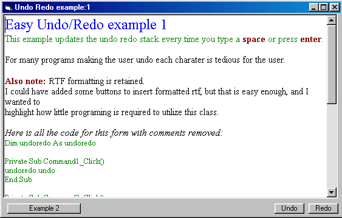



## ezUndoRedo

### Description

This is a simple class module with examples to

add undo/redo functionality to an RichTextBox control. I say simple because there are many ways to implement undo/redo stacks. This is probably the simplest aproach using a single collection for the stack. Other methods include using an array as a stack which is more efficient and seperate undo/redo stacks using either arrays or collections. I used the simplest appraoch here because this is my first class module.

If you like it please vote, and if you want to see changes please let me know.

This class is very simple to use - see examples.
 
### More Info
 
No assumptions, code is documented so everything you need to know is included in the examples.

The class module is not documented - this example shows how to use the class module, and is not intended as tutorial on writing class modules.

             |
---                |---
**Submitted On**   |2001-12-02 21:23:12
**By**             |[RegX](https://github.com/Planet-Source-Code/PSCIndex/blob/master/ByAuthor/regx.md)
**Level**          |Intermediate
**User Rating**    |5.0 (25 globes from 5 users)
**Compatibility**  |VB 6\.0
**Category**       |[Object Oriented Programming \(OOP\)](https://github.com/Planet-Source-Code/PSCIndex/blob/master/ByCategory/object-oriented-programming-oop__1-47.md)
**World**          |[Visual Basic](https://github.com/Planet-Source-Code/PSCIndex/blob/master/ByWorld/visual-basic.md)
**Archive File**   |[ezUndoRedo390731232001\.zip](https://github.com/Planet-Source-Code/regx-ezundoredo__1-29426/archive/master.zip)

